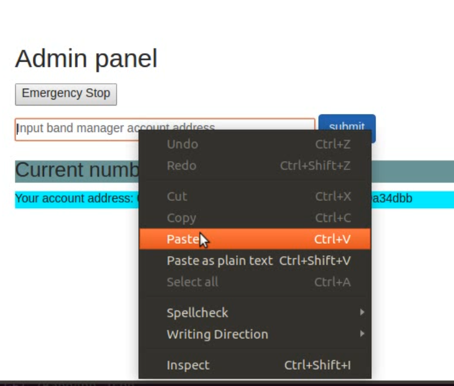

# Final project for the ConsenSys Developer Program 2018-2019
### What does this project do?

This is a decentralized application where a visitor can purchase songs for sale. The songs are listed for sale by the band manager who manages the artist/songs. The app admin is the only one that can that add band managers via their account address. Once added, the band managers can then add songs for sale to the site. Visitors can visit the site and purchase songs in Ether which is sent directly to the band manager who subitted the song.  

Note: This project was developed using Truffle v4.1.14 (core: 4.1.14) Solidity v0.4.24 (solc-js)

truffle.js is specified to use solc version 0.4.24

(but if needed, try running:)

    $ npm uninstall truffle

    $ npm install -g truffle@4.1.14
        
       
### Accounts:
#### Admin - Adds band managers by account address, can see a list of current band managers
#### Band manager - Can add songs for sale
#### Visitor - Anyone with an ethereum account can purchase listed songs for sale
##### (future functionality): a song list will be created and linked to the visitor account to view songs that they purchased, band managers will be able to also add band members and they will have a say in how sales profits are divided

### Libraries used:
SafeMath library from OpenZeppelin was used and imported in BandApp.sol

## How to set up

Clone the repository

To install lite-server and other dependencies, run

    $ npm install
Run a local blockchain
    
    $ ganache-cli

Next, copy the seed phrase from the terminal you ran ganache. 

Open a browser (Chrome preferred) with the Metamask extension installed (be sure Metamask is connecting to localhost on port 8545)

And import using the seed phrase generated by ganache-cli

In the project directory, run in a separate terminal window: 

    $ truffle compile
then

    $ truffle migrate
next, to run the app in the browser that has Metamask, type

    $ npm run dev

The app should now be running in the browser. The first account is set as the admin account, and you will be able to add a band manager from here. For testing, we will use Account 2 to copy the address and input it as a band manager. After submitting the address, the list of band managers will be updated in the Admin panel. And if you switch to Account 2 in Metamask, you will now see a Band Manager panel. Next add a song by inputting a name and price in ether. (Ex: Thriller, 0.07) Now switch to Account 3 (this will be used as a visitor account with no special priviliges). You will now see the song for sale and you can purchase it by clicking the BUY button. Notice the account balances of Account 2 and 3 before and after purchasing the song. Screenshots on how to setup the app are available at the end.

## Testing
step 1. Make sure local blockchain is running, 

    $ ganche-cli

step 2. In the project directory, run in a new terminal window:

    $ truffle test

 

## Circuit breaker (emergency stop) pattern
On the Admin panel of the app, there is an 'Emergency Stop' button. Once this is pressed, songs can no longer be purchased. The first account in MetaMask is set as the admin.

## Design patterns
[design_pattern_desicions.md](..//master/design_pattern_desicions.md)

## Common attacks
[avoiding_common_attacks.md](..//master/avoiding_common_attacks.md)

PoE tutorial, deploy to rinkeby
   Deploy your application onto one of the test networks. Include a document called deployed_addresses.txt that describes where your contracts live (which testnet and address).

   Students can verify their source code using etherscan for the appropriate testnet https://etherscan.io/verifyContract 
    Evaluators can check by getting the provided contract ABI and calling a function on the deployed contract at https://www.myetherwallet.com/#contracts or checking the verification on etherscan

# Screenshots on how to use the app
Open browser

Click on Metamask, click on Import...

### Future implementations:

   Implement an upgradable design pattern
   
   Write a smart contract in LLL or Vyper

IPFS -   Users can dynamically upload documents to IPFS that are referenced via their smart contract

uPort

Ethereum Name Service -   A name registered on the ENS resolves to the contract, verifiable on rinkeby.etherscan.io/contract_name

Oracle
